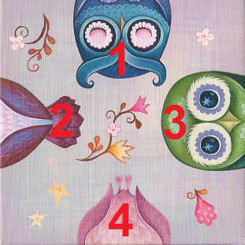

# Crazy9

## Introduction
Solver for Crazy9 puzzle, or as it calls at his original German name: Legespiel.

The Rules of this puzzle are simple, the player needs to place all nine small squares in larger 3x3 square in a manner that all images fit together.

The idea for the solver came to me after purchasing HEYE's Crazy9 Ketner Owls puzzle. At the back of the box it was written that the puzzle has "two different solutions (at least...)". After founding one of them, I was triggered to find the second one and discover what HEYE's creators meant by saying that this puzzle has "at least" two solutions.

<p align="center">
  
</p>

At first, I wrote straight forward solver that checks all possible combinations with all possible card's orientations and saves only the correct one. In total, the algorithm needed to check 9!=362,880 combinations with 4^9=262,144 orientations in each combination, which means that in total there are 9!*4^9=95,126,814,720 combinations. Even if it will take 1 second for the code to check each combination with all its orientation it will take for the code more than 4 days to finish the task. And this is exactly what happened. This code ran for 4 days and presented all 16 possible solutions, but since the puzzle have two identical cards, this number of solutions should be divided by 2 and because the total list of solutions includes in it also rotated solutions, so this number also should be divided by 4. This is how I found the 2 only solutions that this puzzle has.

Of course, this code is very inefficient since after eliminating specific combination by only examining first two cards, all other similar combinations should also be eliminated. It looked like a classic backtracking problem and in the end, this is what I did. I rewrote the code to solve this puzzle with backtracking recursive function. The improved code run for less than 2 seconds and presented me the same 16 solutions that inefficient code found, but much faster. In other words, it was a success!

## Execution
In order to execute the code, the user needs to create a folder with the puzzle that he desires to solve and change the name of the puzzle in the correct place:
```[bash]
puz = "HEYE Ketner Owls"
```

Inside the puzzle folder, the user needs to have a folder that calls "Cards". The folder will have the scans of all 9 cards and "Cards.ini" file in which the user needs to import the figures that the cards have, for example:
```[bash]
[Card_1]
loc1 = Blue Head
loc2 = Purple Tail
loc3 = Green Head
loc4 = Pink Tail
```
where numbering of the locations defined in next manner:
<p>
  
</p>

First, the code will present the summary of the run:
```[bash]
Running time: 1.73160 seconds
Total number of corrected combinations: 16
Number of corrected combinations after elimation of rotated solutions: 4
Number of corrected combinations after elimation double carded solutions: 2
```

After that, the code will save the visual solutions. In order from it to be able to do it, the user must have the scans of the cards in "Cards" folder, named "Card 01.png", "Card 02.png", etc., accordingly to the order and the orientation that was typed in the input file "Cards.ini". This code will create folder "Solutions (Repeated)" inside puzzles folder and will save all possible solutions that the puzzle has. In this folder all solutions will be presented, including the repeated ones, which consist of two kinds: rotated and double carded. The non-repeated solutions will be presented in puzzles folder.

That's it, the code is ready to run. Have fun!

### Note
In addition to HEYE's Crazy9 Ketner Owls puzzle, I found another puzzle online to test the codes, "Houses". Its cards and solutions also included in this repository. Accordingly to HEYE's website, https://heye-puzzle.de/en/?s=crazy9, they have another three puzzles: Burgerman Doddles, Mordillo Cows and Wachtmeister Cats. Hopefully I will purchase them and will be able to present their solutions too.
